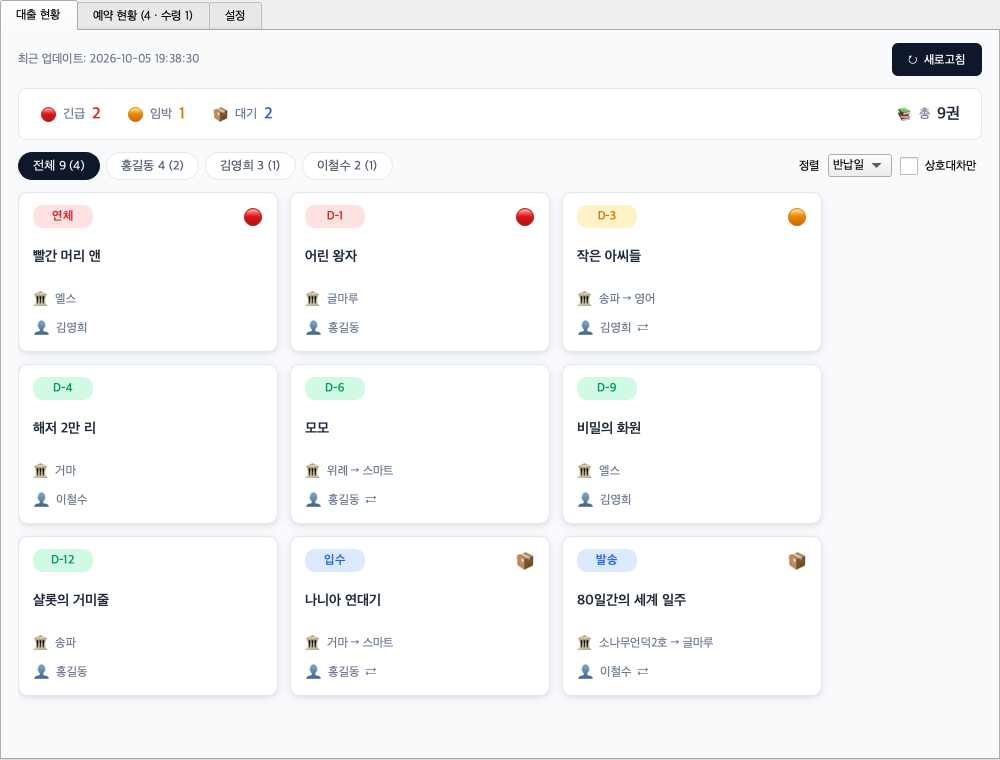
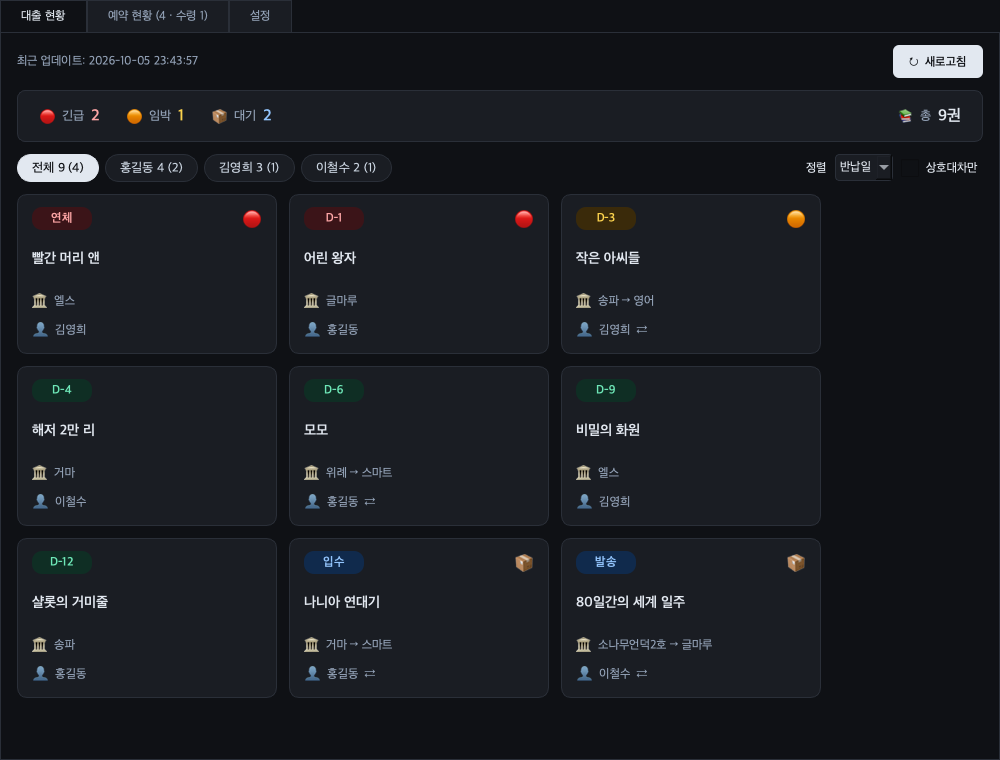
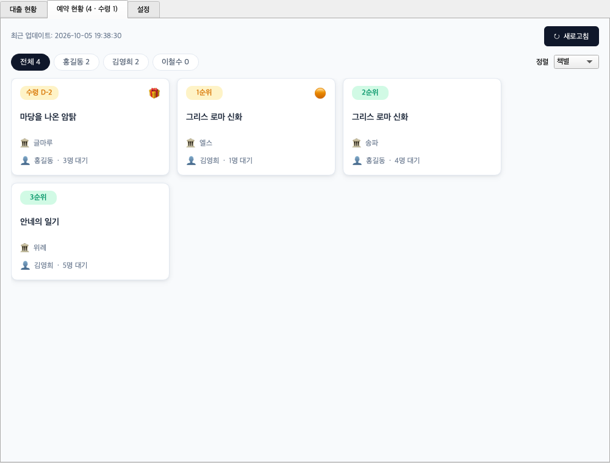
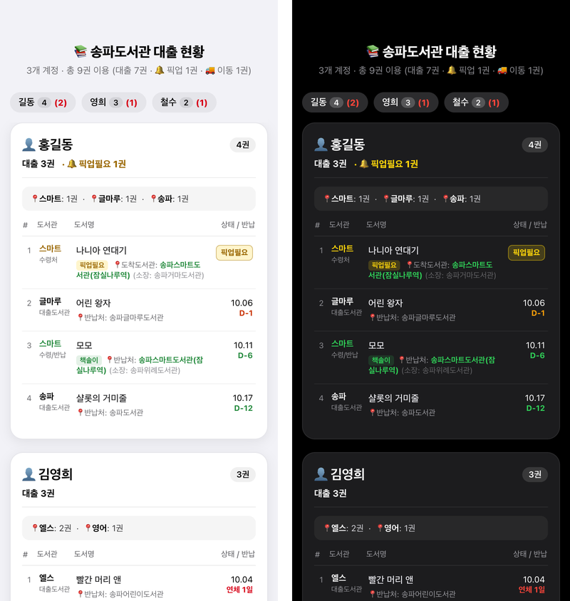
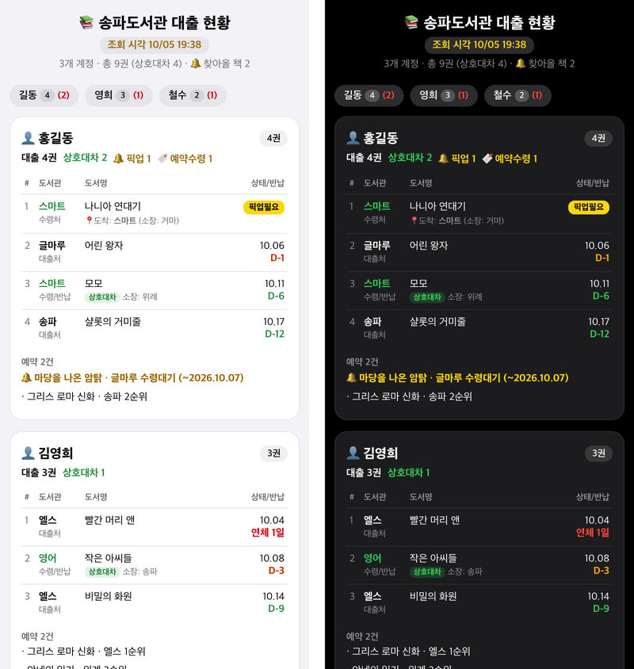

# songpa-loan-tracker

송파구립도서관(splib.or.kr) 대출·예약·상호대차 현황을 한눈에 보여주는 도구입니다.
가족 여러 명의 계정을 한 번에 조회하고, 반납일이 가까운 책과 찾아올 책을 먼저 보여줍니다.

| 형태 | 설명 |
|---|---|
| 🖥️ **데스크톱 앱** (macOS/Windows) | PySide6 앱. 실행 파일 하나로 동작합니다. |
| 📱 **아이폰** ([Scriptable](https://scriptable.app)) | 홈 화면 위젯 + 계정별 카드 화면. [`scriptable/`](scriptable/) 참고 |
| 🤖 **안드로이드 앱** ([반납요정](https://github.com/pchuri/return-fairy)) | 같은 카드 화면 + 매일 반납·찾아올 책 알림. APK로 설치 (별도 저장소) |
| ⌨️ **명령어 `songpa`** (PC·안드로이드 Termux) | 터미널 요약, JSON, 카드 화면(HTML), Termux 알림. AI 코딩 에이전트 스킬로도 사용 |

별도의 서버 없이 PC나 휴대폰이 도서관 홈페이지에 직접 로그인해서 조회합니다.

## 스크린샷

**데스크톱 — 대출 현황**: 반납 임박순 카드, 사용자 칩에 `대출권수 (상호대차권수)` 표시



<details><summary>다크 모드</summary>



</details>

**데스크톱 — 예약 현황**: 수령 대기 예약을 맨 위에, 같은 책 예약은 나란히



**아이폰 (Scriptable)** — 기기 설정에 따라 라이트/다크 모드로 표시



**명령어 `songpa --html`** — 같은 내용을 PC·안드로이드 브라우저에서 카드 화면으로 (라이트/다크 자동)



> 스크린샷은 예시 데이터로 만든 화면입니다.

## 주요 기능

- 📚 **대출 도서**: 반납일·책 제목(정렬 메뉴의 "이름")·도서관별 정렬, 상호대차만 보기, 긴급·임박·대기 요약
- 🔁 **상호대차(책솔이)**: 수령 도서관, 소장 도서관, 진행 상태(입수·발송·요청중) 표시
- 🔖 **예약 도서**: 예약 순번과 수령 마감일, 같은 책을 여러 도서관에 걸어둔 예약은 책별로 묶어 정렬
- 👥 **여러 계정**: 가족 계정을 한 번에 조회, 사용자별 필터
- ⏰ **자동 새로고침**: 5분/10분/30분/1시간 간격 선택
- 🌓 **다크모드**, ⌨️ **키보드 단축키**: F5(새로고침), Ctrl+1(대출)/Ctrl+2(예약)/Ctrl+3(설정)
  - macOS에서는 Ctrl 대신 **⌘(Command)**, 노트북 키보드는 F5 대신 **fn+F5**

## 다운로드 (데스크톱)

[Releases](../../releases)의 `latest-build`에서 최신 빌드를 받으세요. 설치 과정은 없습니다.

- **macOS**: `songpa-loan-tracker-macos.zip` → 압축을 풀고 `songpa-loan-tracker.app` 실행
  - Apple 공증을 받지 않은 앱이라 처음 실행하면 macOS가 열기를 막습니다.
    **시스템 설정 → 개인정보 보호 및 보안** 아래쪽의 **그래도 열기**를 누르세요.
    (macOS 14 이하는 앱을 **우클릭 → 열기**로도 됩니다.)
  - 계정 비밀번호를 암호화하는 키를 키체인에 저장하므로, 처음 실행할 때와 새 버전을 받을 때마다
    키체인 접근을 묻는 창이 뜰 수 있습니다. **항상 허용**을 누르세요.
  - macOS는 자동 업데이트가 없습니다. 새 버전은 `latest-build`에서 다시 받아 교체하세요.
- **Windows**: `songpa-loan-tracker.exe` 실행. 새 버전이 나오면 "업데이트하고 다시 시작할까요?"라고 묻고,
  승인하면 내려받아 교체한 뒤 다시 시작합니다.

## 사용 방법 (데스크톱)

1. **설정 탭**에서 도서관 계정 추가
   - 회원번호(도서관 홈페이지 아이디)와 비밀번호 입력
   - "추가 / 수정" 버튼 클릭
   - "저장 및 적용" 버튼으로 설정 저장

2. **대출 현황 탭**에서 도서 확인
   - "새로고침" 버튼으로 최신 정보 조회
   - 도서 카드 클릭으로 상세 정보 확인
   - 정렬/필터 옵션으로 목록 관리

3. **예약 현황 탭에서 예약 확인**
   - 수령 마감일이 걸린 예약은 정렬과 무관하게 항상 맨 위에 표시
   - "책별" 정렬로 같은 책을 걸어둔 도서관들을 나란히 비교 (순번이 빠른 곳부터)
   - 카드 클릭으로 자료실 위치와 예약만기일 확인

4. **선택 사항**
   - 자동 새로고침 간격 설정
   - 다크모드 활성화

설정은 `~/.songpa-loan-tracker/config.json`에 자동 저장됩니다.
파일이 손상되거나 읽을 수 없으면 원본을 보호하기 위해 자동 저장과 "저장 및 적용"이
중단되고 안내가 표시됩니다. 앱을 종료한 뒤 안내된 파일을 백업하고 복구하세요.
처음부터 설정하려면 백업한 파일을 다른 이름으로 옮긴 뒤 앱을 다시 실행하세요.
계정 ID·비밀번호·화면 설정의 잘못된 형식도 저장 전에 검사합니다. 여러 앱 인스턴스의
저장은 잠금으로 순서를 보장하고 각자 임시 파일을 사용합니다. 다른 인스턴스가 설정을
사용 중이라 잠금을 얻지 못한 경우에도 저장을 중단하므로, 다른 앱을 종료한 뒤 다시 실행하세요.

## 안드로이드 앱 (반납요정)

[반납요정](https://github.com/pchuri/return-fairy)은 같은 카드 화면을 안드로이드 앱으로 보여 주고, 매일 정한 시각에 조회해서
연체·반납 임박·찾아올 책을 알려 줍니다. 구글 플레이에는 없고 [최신 릴리스](https://github.com/pchuri/return-fairy/releases/latest)의
APK로 설치합니다. 도서관 조회 코드는 이 저장소의 `songpa_core/`를 Kotlin으로 옮긴 것이라 권수 기준이 같습니다.

## 아이폰 (Scriptable)

[Scriptable](https://scriptable.app) 앱용 스크립트입니다. 홈 화면 위젯에서 반납이 가까운 책과 찾아올 책을 보여주고,
위젯을 누르면 계정별 카드 화면이 열립니다. 설치·계정 설정·자동 업데이트는 [`scriptable/README.md`](scriptable/README.md)를 참고하세요.

## 명령어 (songpa)

터미널에서 쓰는 조회 명령어입니다. PC(macOS·Windows·리눅스)와 안드로이드 [Termux](https://termux.dev)에서 동작합니다.

### 설치

```bash
# PC: uv와 git이 있으면 (https://docs.astral.sh/uv/, Windows는 https://git-scm.com/)
uv tool install git+https://github.com/pchuri/songpa-loan-tracker

# 안드로이드 Termux
pkg install python git
pip install git+https://github.com/pchuri/songpa-loan-tracker
```

- 화면 프로그램(PySide6)은 설치하지 않습니다.
- Termux에서 설치 중 컴파일 오류가 나면 `pkg install clang` 후 다시 설치하세요.
  (2026-10 기준 Termux 파이썬 3.14에서는 aiohttp가 안드로이드용 완성본으로 받아져 컴파일 없이 설치됐습니다.)
- 업데이트: `uv tool upgrade songpa-loan-tracker`
  (Termux는 `pip install --upgrade --force-reinstall --no-deps git+https://github.com/pchuri/songpa-loan-tracker`)

### 계정 등록

```bash
songpa accounts add       # 이름·아이디·비밀번호를 차례로 입력 (비밀번호는 화면에 안 보임)
songpa accounts list      # 등록된 계정 보기
songpa accounts remove 홍길동
```

### 조회

```bash
songpa                    # 전체 계정 요약
songpa -u 홍길동          # 한 사람만 (여러 번 쓸 수 있음)
songpa --html             # 카드 화면을 브라우저로 열기 (아이폰 화면과 같은 모양, 라이트/다크 자동)
songpa --json             # JSON 출력 (스크립트·AI용)
songpa --notify           # Termux 알림으로 보내기 (pkg install termux-api + Termux:API 앱 필요)
songpa --due-soon 5       # 반납 임박 기준 바꾸기 (기본 3일)
```

- 안드로이드에서 `--html`은 폰 안에서만 열리는 임시 주소(`127.0.0.1`)로 2분 동안 화면을 띄우고 브라우저로 엽니다.
  주소에는 매번 바뀌는 임의의 경로가 들어가고, 그 화면 한 장 말고는 아무 파일도 내보내지 않습니다.
- Termux:Widget 앱을 쓰면 `~/.shortcuts/`에 `songpa --html`을 넣은 스크립트를 두고 홈 화면 버튼으로 실행할 수 있습니다.
- AI 코딩 에이전트(Claude Code·Codex 등)용 스킬 설명은 [`skills/songpa/SKILL.md`](skills/songpa/SKILL.md)에 있습니다.

## 알아 두기

- **네트워크**: splib.or.kr에 직접 닿는 네트워크에서만 동작합니다. 집·휴대폰(LTE/5G)에서는 정상이지만,
  클라우드 서버나 일부 회사·기관 네트워크(VPN 포함)에서는 도서관 홈페이지 접속이 막혀 조회가 실패할 수 있습니다.
- **계정 정보**: 데스크톱은 PC에 암호화해서(암호화 키는 OS 키체인) 저장하고, 아이폰은 iOS 키체인에 저장합니다.
  `songpa` 명령어는 macOS·Windows에서는 비밀번호를 OS 키체인에, 안드로이드 Termux·리눅스에서는 설정 파일
  (`~/.config/songpa/accounts.json`, 본인만 읽기 가능)에 저장합니다. 파일에 저장할 때는 암호화하지 않으므로
  다른 사람과 같이 쓰는 기기에서는 쓰지 마세요.
  계정 정보는 도서관 홈페이지 로그인에만 쓰이고 다른 곳으로 전송되지 않습니다.
- **비공식 도구**: 송파구립도서관과 관계없는 개인 프로젝트입니다. 도서관 홈페이지 구조가 바뀌면 조회가 안 될 수 있습니다.
  (데스크톱·`songpa` 명령어는 `songpa_core/`, 아이폰은 `scriptable/songpa-loan-tracker.js`, 안드로이드 앱은 반납요정 저장소의 `core/` 파서를 함께 고칩니다.)

---

# 개발자용

## 프로젝트 구조

- `src/main_app.py` — PySide6 GUI 메인 애플리케이션
- `songpa_core/` — 도서관 웹 스크래핑 로직 (데스크톱 앱과 `songpa` 명령어가 같이 씀)
- `songpa_cli/` — `songpa` 명령어 (`pyproject.toml`의 기본 의존성만 사용)
- `skills/songpa/` — AI 코딩 에이전트용 스킬 설명
- `songpa-loan-tracker.spec` — PyInstaller 빌드 설정
- `scriptable/` — 아이폰 Scriptable 스크립트 (JavaScript, `songpa_core/`와 별도 파서)
- `docs/images/` — README 스크린샷

## 개발 환경 설정

### 1. uv 설치 및 의존성 설치
```bash
cd songpa-loan-tracker

# uv 설치 (최초 1회)
curl -LsSf https://astral.sh/uv/install.sh | sh
source ~/.local/bin/env

# 의존성 설치 및 가상환경 생성 (데스크톱 앱용 desktop 그룹과 dev 그룹까지 설치)
uv sync

# 앱 실행
uv run src/main_app.py

# 명령어 실행 / 테스트
uv run songpa --help
uv run pytest
```

## 자동 업데이트 동작 (Windows)

- `main` 브랜치에 push되면 GitHub Actions가 자동으로 빌드하고 `latest-build` 릴리스를 갱신합니다.
- CI가 빌드할 때 리포 루트의 `VERSION` 값을 앱 안(`src/_version.py`)과 릴리스의 `version.json`에 함께 넣습니다.
  Windows 앱은 시작할 때 자기 버전과 `latest-build`의 `version.json`을 비교해서 새 버전이면 업데이트를 묻습니다.
  (소스 실행과 macOS 빌드는 업데이트를 확인하지 않습니다.)
- 사용자에게 새 버전을 알리고 싶을 때만 `VERSION`의 숫자를 올리고 push하세요 (예: `1.0.0` → `1.1.0`).
  Windows 빌드 작업이 끝나 `version.json`이 올라간 뒤부터 안내가 뜹니다.
  문서만 고친 커밋에는 `VERSION`을 올리지 않으면 사용자에게 업데이트 안내가 뜨지 않습니다.
- 리포가 공개 상태라 별도 토큰 없이 릴리스를 내려받습니다.
  (비공개로 바꾸면 Actions 시크릿 `UPDATER_TOKEN`에 이 리포 contents 읽기 전용 fine-grained 토큰이 필요합니다.)

## macOS 앱 빌드

### 방법 1: 로컬 빌드

```bash
# PyInstaller 설치
uv pip install pyinstaller

# 빌드 실행
.venv/bin/pyinstaller songpa-loan-tracker.spec

# 빌드된 앱 실행
open dist/songpa-loan-tracker.app
```

빌드된 `songpa-loan-tracker.app`은 다른 Mac에서도 실행 가능합니다 (Python 설치 불필요).

### 방법 2: GitHub Actions 자동 빌드

1. GitHub 저장소의 **Actions** 탭 이동
2. **build-desktop** workflow 선택
3. **Run workflow** 버튼 클릭
4. 완료 후 **Artifacts**에서 다운로드
   - `songpa-loan-tracker-macos` (macOS용)
   - `songpa-loan-tracker-windows` (Windows용)

## 배포

### ZIP 파일로 배포
```bash
# zip -r 대신 ditto를 쓴다. zip은 앱 번들의 심볼릭 링크·확장 속성을 망가뜨려 압축을 푼 앱이 실행되지 않을 수 있다.
ditto -c -k --keepParent dist/songpa-loan-tracker.app dist/songpa-loan-tracker-macos.zip
```

### DMG 생성 (선택)
```bash
brew install create-dmg
create-dmg \
  --volname "songpa-loan-tracker Installer" \
  --window-pos 200 120 \
  --window-size 800 400 \
  --icon-size 100 \
  --app-drop-link 600 185 \
  songpa-loan-tracker-Installer.dmg \
  dist/songpa-loan-tracker.app
```

### 코드 서명 (권장)
Apple Developer 계정이 있는 경우:
```bash
codesign --deep --force --verify --verbose \
  --sign "Developer ID Application: YOUR_NAME" \
  dist/songpa-loan-tracker.app
```

### 키체인 접근 권한 유지 (ad-hoc 서명 문제)

앱은 비밀번호 암호화용 마스터 키를 macOS 로그인 키체인(서비스 `songpa-loan-tracker`)에
저장합니다. PyInstaller 기본 빌드는 ad-hoc 서명이라 빌드할 때마다 서명이 바뀌고,
macOS 키체인 ACL은 이를 매번 다른 앱으로 취급해 접근 허용 프롬프트를 다시
띄웁니다. 프롬프트를 승인할 수 없는 환경(예: 로그인 키체인 비밀번호 불일치)에서는
앱이 저장된 비밀번호를 읽지 못합니다.

해결 방법은 **빌드 간에 유지되는 고정 서명 identity**로 서명하는 것입니다.
Apple Developer 계정이 없으면 자체 서명 인증서로도 충분합니다:

1. **키체인 접근** 앱 → 메뉴 `키체인 접근 > 인증서 지원 > 인증서 생성...`
   - 이름: `songpa-loan-tracker Dev` (임의), 인증서 유형: **코드 서명**, 로그인 키체인에 저장
2. `CODESIGN_IDENTITY` 환경 변수로 빌드하면 자동으로 서명됩니다:
   ```bash
   CODESIGN_IDENTITY="songpa-loan-tracker Dev" .venv/bin/pyinstaller songpa-loan-tracker.spec
   ```
   변수를 지정하지 않으면 기존과 동일하게 ad-hoc 서명됩니다. 인증서가 없는
   CI 빌드가 실패하지 않도록 opt-in으로 두었습니다. 이미 빌드된 앱에
   나중에 서명하려면 `codesign --force --deep --sign "songpa-loan-tracker Dev" dist/songpa-loan-tracker.app`.

   서명 확인: `codesign -dvv dist/songpa-loan-tracker.app` 출력에 `Authority=songpa-loan-tracker Dev`가
   보이면 정상입니다 (ad-hoc이면 Authority 줄이 없습니다). 서명만 확인하지 말고
   앱이 실제로 뜨는지도 확인하세요.

   서명 시 `resources/entitlements.plist`가 함께 적용됩니다. 자체 서명 인증서는
   Team ID가 없어서 하드닝 런타임의 라이브러리 검증이 번들된 libpython/Qt 로드를
   거부하는데(`different Team IDs`), 이 plist의 `disable-library-validation`이
   그것을 해제합니다. Developer ID로 공증까지 하면 필요 없습니다.
3. 서명된 앱을 처음 실행할 때 키체인 프롬프트에서 **항상 허용**을 선택하면,
   이후 같은 identity로 서명된 빌드에서는 프롬프트가 다시 나타나지 않습니다.

키체인 접근이 거부되어도 앱은 크래시 없이 실행되며(계정 목록은 표시되지만
비밀번호는 비어 있음) 저장된 암호화 비밀번호는 삭제되지 않습니다. 키체인 접근을
허용한 뒤 앱을 다시 실행하면 자동으로 복구됩니다.

## 라이선스

MIT — [LICENSE](LICENSE) 참조
